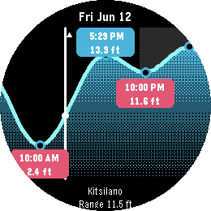
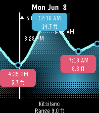
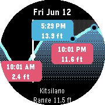
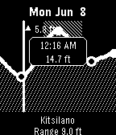
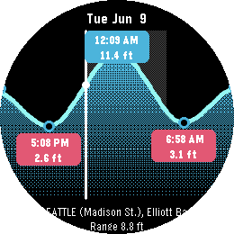
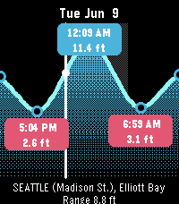
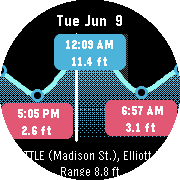
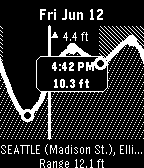

# Pebble Tides

A Pebble watchapp that shows the day's predicted tides for your nearest Canadian
tide station. It graphs the high and low tides across the day with their exact
times and heights, marks where the tide is right now, and lets you step through
upcoming tides. Predictions come from the Fisheries and Oceans Canada (DFO)
IWLS service and cover the British Columbia coast.

## What it does

- Picks the nearest station to your current location from a curated list, using
  the phone's GPS.
- Fetches a week of high/low predictions, caches them on the watch, and refreshes
  once a day. It keeps working with the phone out of range.
- Draws a smooth tide curve with the high/low marked, the current level and
  whether the tide is rising or falling, and mid-tide times.
- Computes sunrise and sunset on-device and shades the night hours.

## Screenshots

Canadian station (DFO):

| Pebble Round 2 (gabbro) | Pebble Time 2 (emery) | Time Round (chalk) | Black & white (diorite) |
|---|---|---|---|
|  |  |  |  |

US station (NOAA) — Seattle:

| Pebble Round 2 (gabbro) | Pebble Time 2 (emery) | Time Round (chalk) | Black & white (diorite) |
|---|---|---|---|
|  |  |  |  |

## Controls

- **Up / Down**: step to the previous / next tide (the window re-centres with a
  short animation).
- **Long-press Up / Down**: jump back / forward about a day.
- **Select**: jump to the next upcoming tide.
- **Back**: exit.

## Settings (phone app configuration)

Open the app's settings from the Pebble phone app:

- **Units**: feet or metres (default feet).
- **Clock**: 12-hour or 24-hour (default 12-hour).
- **Mid-tide times**: show or hide (default show).

## Building & running

```sh
pebble build                          # build for all target platforms
pebble install --emulator gabbro      # run on the gabbro (Pebble Round 2) emulator
pebble install --phone <ip>           # install to a paired phone
```

The build produces `build/pebble_tides.pbw`, which can be sideloaded or uploaded
to the Rebble appstore.

## Target platforms

Built for all seven SDK platforms. The app is designed for **gabbro** (Pebble
Round 2, colour) first; **chalk**, **emery**, and **basalt** are the other colour
screens, and **aplite**, **diorite**, **flint** are 1-bit black-and-white.

## Project layout

```
src/c/                 C watchapp (graph, navigation, rendering, cache)
src/pkjs/              PebbleKit JS (location, fetch, config, transport)
resources/images/      Launcher and store icons
package.json           Metadata (UUID, platforms, message keys, resources)
CONTEXT.md             Domain glossary
docs/adr/              Architecture decision records
```

## How it works

Pebble C can't make network calls or read GPS, so the phone side
(`src/pkjs/`) does the location lookup and the API fetch, packs a week of tide
extrema into a compact binary blob, and streams it to the watch over AppMessage
in chunks. The watch persists it and draws the curve as a cosine between
consecutive high/low extrema (see `docs/adr/0002`). Heights are stored in metres
and converted at render time.

## Documentation

Full SDK docs and API reference: <https://developer.repebble.com>

## Updating / publishing

The build and appstore upload are scriptable with the Pebble CLI.

```sh
make build      # build the .pbw
make install    # build + run on the gabbro emulator
make test       # run the JS unit tests
make emu-australia  # run the emulator forced to Sydney (exercises BOM)
make emu-seattle    # run the emulator forced to Seattle (exercises NOAA)
make emu-vancouver  # run the emulator forced to Vancouver (exercises DFO)
make release    # cut a GitHub release with the .pbw (tag from package.json)
make screenshots# capture fresh store screenshots into screenshots/
make publish    # build + upload to the repebble appstore
```

`make publish` runs `scripts/publish.sh`, which builds and calls `pebble publish`
with the name, version (from `package.json`), description (`store/description.txt`),
icons (`resources/images/`), and the screenshots in `screenshots/`. Run
`pebble login` once first (or set `PEBBLE_FIREBASE_ID_TOKEN` for CI), and set a
valid appstore `CATEGORY` in the script. Add `--is-published` to make the
release visible immediately:

```sh
scripts/publish.sh --is-published
```

Releases are manual: run `make publish` (or `make release`) from a machine where
you've run `pebble login`. There is no CI auto-publish, because the appstore
login needs an interactive browser step that can't run headless.

Release notes live in `CHANGELOG.md`. Before releasing, write the changes as
bullets under `## [Unreleased]`. `make release` promotes that section to the new
version and posts it as the GitHub release notes; `make publish` posts the same
version's section to the appstore (override with `RELEASE_NOTES=...`). Both fail
fast if the section is empty, so a release never ships with placeholder notes.
